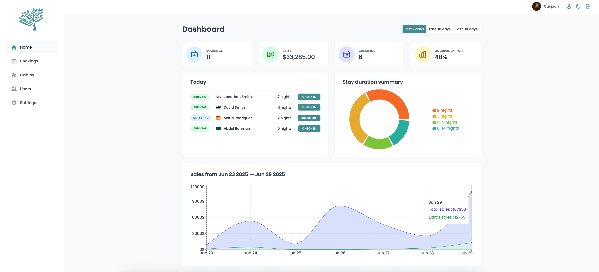

# Code along React Course [(Udemy)](https://www.udemy.com/course/the-ultimate-react-course/)

Full-Stack React App

## Internal Hotel Management App

Internal tool for managing hotel operations, including bookings, cabin details, and user data. Powered by Supabase for backend services such as image storage, API integration, and user authentication.

Topics:

- Supabase, Styled Components and React Query

Tech stack:

- Routing: React Router
- Styling: Styled Components
- Remote state management: React Query
- UI State management: Context API
- Form management: React Hook Form
- Backend (API): Supabase
- Other: Recharts

### Home / Dashboard page

### Dark mode

### Cabins page

### Add/Edit Cabin

### Bookings page

### Booking details

### Create user page

